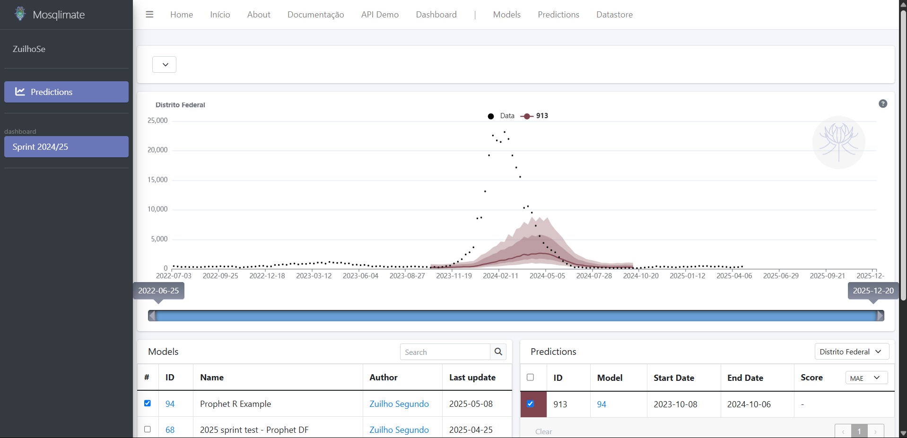

This script shows how to fit a Prophet forecast model to the dengue data and upload it to 
the Mosqlimate platform. Your job is to do better than this model!  

## Getting the system ready

To latter upload your projections to the platform, you will use the mosqlient, a python
interface. To run the commands, the reticulate library is required.

```{r}
# un/comment if you need to install these libraries
#install.packages('pak') # useful for installing reticulate
library(reticulate)
library(pak)
library(prophet)
library(data.table)
library(tidyverse)
library(epitools)
pak::pak("rstudio/reticulate")
```

```{r}
py_config()
```

Get your API_KEY:

```{r}
API_KEY =  'X-UID-Key'
```

Now it is time to install the mosqlient

```{r}
# un/comment if you need to install them
#py_install("mosqlient>=1.9.3")
py_require(c("mosqlient>=1.9.3"))
mosq <- import("mosqlient")
```

## Reading the data

The data are available for downloading [here](https://sprint.mosqlimate.org/data/). They are gzip compressed csv files. Here, we will use only
the disease data.  

The dengue data is provided by week and by municipality. 

```{r, results='hide'}
data <- fread("~/GitHub/sprint-template-2025/Demo Notebooks/dengue.csv.gz")
head(data)
```

## Creating a Prophet forecast model for the challenge

For this demonstration we will train an Prophet model. 

We begin defining the interval dates:

```{r}
# define date based on start date of week number
end_date_train <- as.Date("2023-06-18") # epiweek 25
#print(epiweek(end_date_train))
start_for_date <- as.Date("2023-10-08") # epiweek 41
#print(epiweek(start_for_date))
```

Let's for the sake of this example fit the dengue series for the state of Distrito Federal (UF="DF").

The first challenge is to forecast 23/24 season using previous data. 

```{r}
dDF.train <- data %>%
  filter(date <= end_date_train) %>%
  filter(uf == "DF") %>% 
  group_by(date) %>% 
  summarize(casos=sum(casos)) %>% 
  arrange(date)

# Renaming the columns and applying log transformation
dDF.train <- dDF.train %>%
  rename(ds = date, y = casos) %>%
  mutate(ds = as.Date(ds)) %>%
  select(ds, y) %>%
  mutate(y = log(y + 1))
```

We begin fitting the model:

```{r}
model <- prophet(dDF.train, weekly.seasonality=TRUE)
```

Creating tibble with predictions dates

```{r}
future <- make_future_dataframe(model, periods = 67, freq = "week")
tail(future)
```

Making insample predictions:

```{r}
forecast_insample <- future %>%
  filter(ds <= end_date_train)

forecast <- predict(model, forecast_insample)

plot(model, forecast)
```

## Preparing the output for uploading

First, register your model in the platform. If you have already done this, you can skip this step.
You need your API key, to get it, see the instructions in the github readme.

```{r}

response = mosq$upload_model(
    api_key=API_KEY,
    name="Prophet R Example",
    description="test model for 2025 in R",
    repository="https://github.com/Mosqlimate-project/sprint-template-2025/",
    implementation_language="R",
    disease= "dengue",
    temporal= TRUE,
    spatial=FALSE,
    categorical=FALSE,
    adm_level=1,
    time_resolution="week",
    sprint=TRUE
)

response
```

Now, to register your prediction, you need: 
1. the id number of your model
2. dataframe with the following columns: 

date(YYYY-mm-dd): same used in the dataset
pred (num): point estimates
lower_95 (num): 95% lower interval
lower_90 (num): 90% lower interval
lower_80 (num): 80% lower interval
lower_50 (num): 50% lower interval
upper_50 (num): 50% upper interval
upper_80 (num): 80% upper interval
upper_90 (num): 90% upper interval
upper_95 (num): 95% upper interval

```{r}
# predict out sample data
forecast_outsample <- future %>%
  filter(ds >= start_for_date)

samples <- prophet::predictive_samples(model, forecast_outsample)
yhat_samples <- samples$yhat

# Calculate the percentiles
percentiles <- c(0.025, 0.05, 0.10, 0.25, 0.50, 0.75, 0.90, 0.95, 0.975)
quantis_log <- t(apply(yhat_samples, 1, quantile, probs = percentiles))
quantis <- expm1(quantis_log)

# transform dataframe
df_forecast <- as.data.frame(quantis)
colnames(df_forecast) <- c("lower_95", "lower_90", "lower_80", "lower_50",
                           "pred", "upper_50", "upper_80", "upper_90", "upper_95")
df_forecast$date <- as.Date(forecast_outsample$ds)

head(df_forecast)
```

Now, to upload the prediction we will use the `mosqlient` library to handle the POST, instead of the way we did for the model's registration. This will make things substantially easier. For this step you need your *model's id number* found in your profile page in the mosqlimate API website, and collect the commit number of the version of the code at the time of the prediction's generation. 

```{r}
mosq$upload_prediction(
    model_id=94,
    description="test for sprint 2025 preds of the Prophet model in DF in R",
    commit="df1c695eaa5af5edb125a9d4ec72a4d2528c7411",
    predict_date="2025-05-08",
    prediction=df_forecast,
    adm_1="DF",
    api_key="your-key"
)
```

If everything worked, now you will be able to visualize your predictions in the [Mosqlient Dashboard](https://api.mosqlimate.org/vis/dashboard/?dashboard=sprint) under the "Sprint 2024/25" tab:


> Hint: if you want to see the predictions confidence intervals, you can click on the desired curve.

