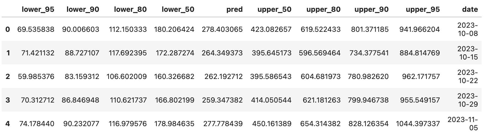

# 2025 Infodengue-Mosqlimate dengue Forecast Sprint
<p align="center">
  
</p>

## Registering in the Mosqlimate Platform
The Mosqlimate Platform is responsible for all interactions with the the participants of this sprint, including getting the data and uploading predictions. Therefore, to participate in this sprint, the first step we require from you, as team leader, is to register your team to the Mosqlimate platform (There is not cost associate with this membership). In order to to this, simply go to [api.mosqlimate.org](https://api.mosqlimate.org/), click on the "Login with GitHub" in the top right corner of the page, and follow the instructions. Once you create your Mosqlimate profile, you are set to follow the steps below.


That's how it looks like if you got this step right. Notice the **blue button** on your profile page. If you click on it will show your unique API Key which you will need to access the data, register your model and upload your predictions.

The **Models** table at the top of your profile page is now empty. But as you register models, they will be listed here. You will come back here to get your model's autogenerated id number, that will be required to upload their predictions.

Now let's move on to setting up the GitHub repository for your submission.

## Using the GitHub template for the Infodengue Sprint submission
This github repository should be used as a template for developing your submission for the 2025 Infodengue Sprint. To know about the challenge, please read carefully [sprint rules](https://sprint.mosqlimate.org/2025/). 

If you have a GitHub account, you can create a new public repository clicking the (+) button on the top right of this page. In the following page, you can create the repo under your user as shown below, make sure to use our template as indicated by the red arrow in the figure below. You can name your repository any way you like, we recommend a name easy to remember!


Don't forget to set it as a public repository and include a clear explanation of your model methodology and code structure in the README.md.!
 
## Step-by-step tutorial on how to prepare your submission
Now that you have your repository setup, be aware that all the code related to your model should be committed to it. If you want to register more than on model, be sure to repeat the step above for each one, so that they are in separate repositories.

We assume here that you are already familiar with GitHub and how to use it. If you're not, please take a look at [this tutorial](https://docs.github.com/en/get-started/start-your-journey/hello-world).

If you already have source code related to the model you will work with, you can copy the code to this repository, or start from scratch based on your previous code.

## Checking for minimal configuration requirements on your operating system

Since you are going to use a python library to submit your work, before installing it you need to make sure that you OS has a working Python installation.

On a debian-based Linux distribution(Ubuntu, Mint, etc.), just run the following command:

```bash
sudo apt install python3-dev jupyter python3-venv python3-pip
```

On Mac OS (using homebrew):
```
# Install Python and Jupyter
brew install python
pip3 install jupyter

# Install virtual environment and development headers
pip3 install virtualenv
```

### Installing the Mosqlient library
The Mosqlimate platform is where all models and predictions are stored, alongside with the data used for the modeling. It provides a [REST API](https://api.mosqlimate.org/api/docs) that is completely language agnostic, for accessing the data as well as registering models. It is fully documented but requires some familiarity with APIs to use.

In addition, we make available a a simplified client library named [Mosqlient library](https://github.com/Mosqlimate-project/mosqlimate-client), available for Python and R (using `reticulate`), that simplifies the interaction with the platform.

To install the library for Python, from the OS terminal type:

```bash
$ pip install -U mosqlient
```

Ensure your Python version is 3.10 or higher, but lower than 3.13 to install the latest version of the package (1.9.3).

for R:

```R
> library(reticulate)
> py_install("mosqlient")
```

You need to already have the reticulate package installed.

### Starting your work!
We prepared a couple of demo Jupyter notebooks to get you started.  In you local computer make sure you have Python 3.10 or higher, but lower than 3.13, and Jupyter installed.

If you are an R user, make sure you have the R kernel installed in your Jupyter notebook. you can install it by running the following command **in an R terminal**:

```R
> install.packages("IRkernel")
> IRkernel::installspec()
```

After this you can just open the notebooks indicated below and follow the instructions in them.

Follow the [R demo rmd](/Demo%20Notebooks/R%20demo.Rmd) or [Python demo notebook](/Demo%20Notebooks/Python%20demo.ipynb) to learn of the essential steps you must follow to complete a submission of your work. If you run into dificulties, please reach out fo help at our [discord server](https://discord.gg/yqtgW4TC).

## Model and Prediction Specifications
After you finish fitting your model, youl will need to register it on the platform and upload its prediction for each target area (UF or Country).

These data will have to be formatted as JSON objects. For the model registration it will look like this:

```JSON
{
        "name": "my_model",
        "description": "model's description",
        "repository": "https://github.com...",
        "implementation_language": "R",
        "disease": "dengue",
        "temporal": true,
        "spatial": false,
        "categorical": false,
        "adm_level": 1,
        "time_resolution": "week",
        "sprint": True
    }
```

where `adm_level` 1 indicates to a state-level forecasting model. Country-level would be level 2.

For a prediction the JSON Object will look like this:
```JSON
{
  "model": 24,
  "description": "My Prediction description",
  "commit": "3d1d2cd016fe38b6e7d517f724532de994d77618",
  "predict_date": "2023-10-31",
  "adm_0":"BRA",
  "adm_1": adm_1, 
  "adm_2": null,
  "adm_3": null,
  "prediction": {...}
}
```

Model on the JSON above contains the ID of the model you registered on the platform. You can find this number on you profile page, where all your registered models will be listed. `commit` is the git last commit id you repository is in. This indicates the specific version of your code that generated the prediction. This is important for reproductibility reasons. You can find the commit id with the `git log` command. The last commit id will appear at the top of the log. it can also be seen on the main page of your repository on GitHub. The `predict` field should point to anothe JSON object corresponding to the actual model output which will look like this:



but exported as JSON.

For detailed instruction on how to upload the models and predictions, please consult the demo Notebooks, scripts and the [mosqlient documentation](https://mosqlimate-client.readthedocs.io/en/latest/tutorials/API/registry/). Also feel free to ask questions on our [discord server](https://discord.gg/xNAt3tGJK5). 


